# ピッチ用メモ

(ペルソナ)
あなたは、これから WASM コントラクト開発・Astar Network について学び始めようとしています。

(問題定義)
多くの Web3 界隈の人々が WASM コントラクト開発や Astar Network に興味を持ち始めています。
効率良く WASM コントラクト開発や AstarNetwork についてポイントを押さえながら学習もしたいし、Dapp にも触れてみたいと考えています。

(アプリを作った必要性)
この Astar Learning は、このような人々のニーズに応えるために開発しました。

1. WASM コントラクト初学者
2. Astar Network を知りたい人
3. WASM コントラクトを使った Dapp に触れてみたい人

(解決アプローチ)
このアプリ自体が WASM コントラクトと連動した Dapp になっていて、学習コンテンツを読み終えれば NFT を発行することができます。
ここで獲得した NFT は、将来の雇用主や大学入学委員会に提出することができますし、学習した直後に実際に動く Dapp に触れることができます。
知識と実体験に基づく input を得る機会を提供します。

(結局何ができるのかと今後の将来像)
このアプリは、これからエコシステムに参入してくる人々へのハードルを下げることができます。(学習や理解を得る機会を提供します。)
理想系は、学習コンテンツを任意の人が作成し良質なコンテンツには投げ銭が行えその提供者にはリワードが与えられる仕組みです。
今はまだ第一段階ですがこれから私自身勉強しながら進化させていく予定です。

### 以下、スライド資料

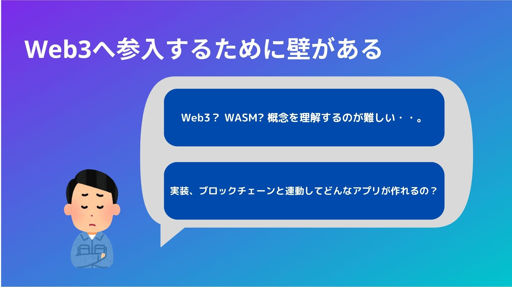
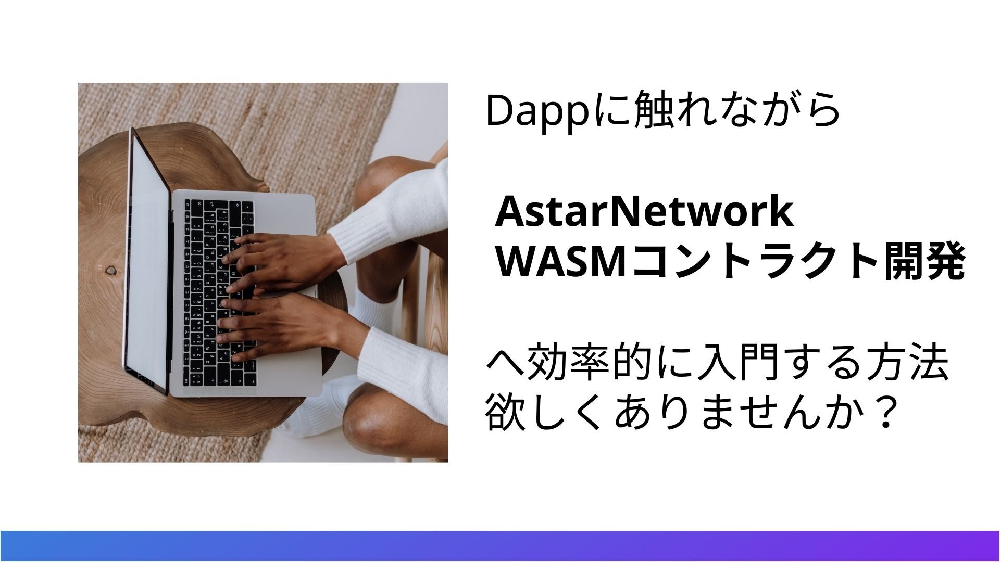
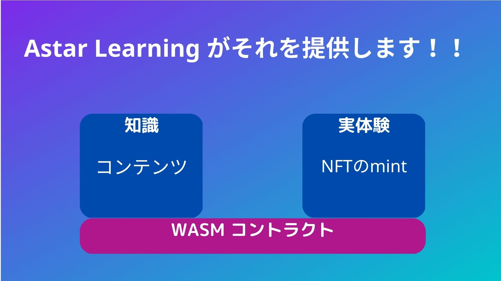
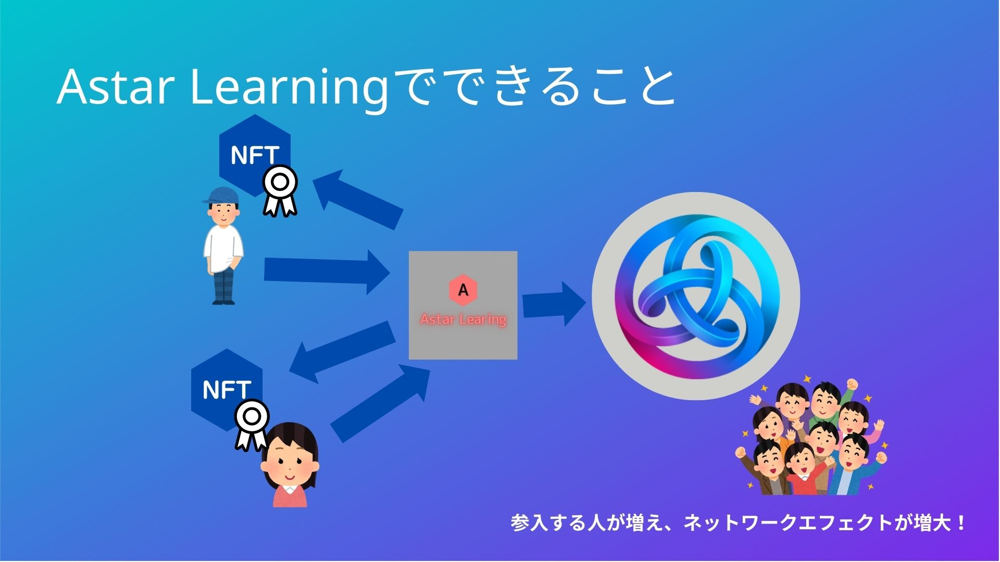
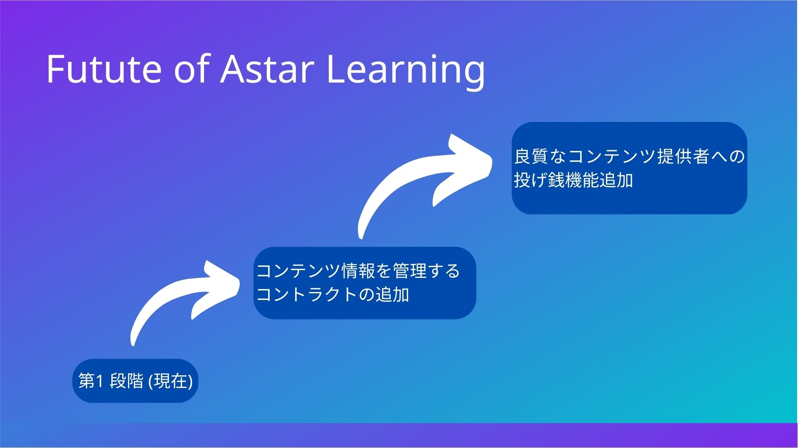
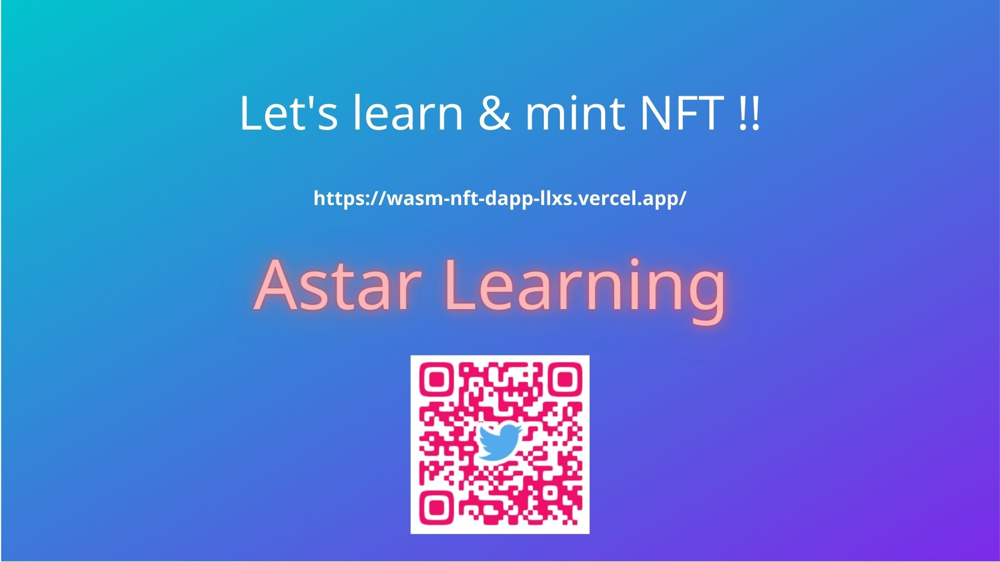
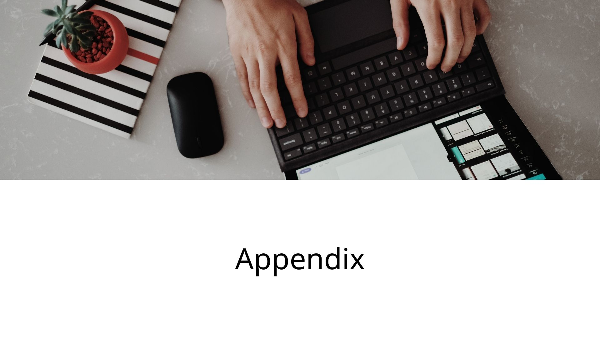
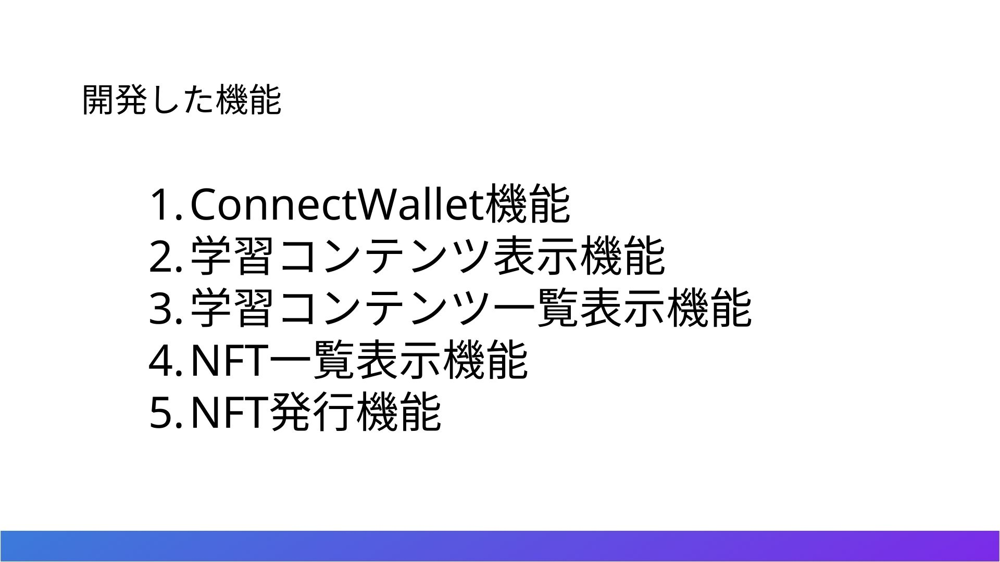
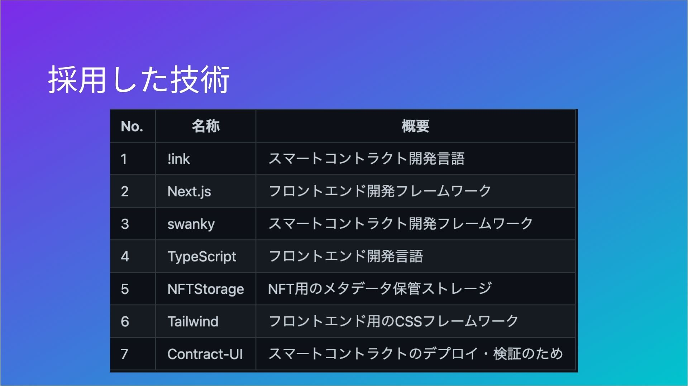
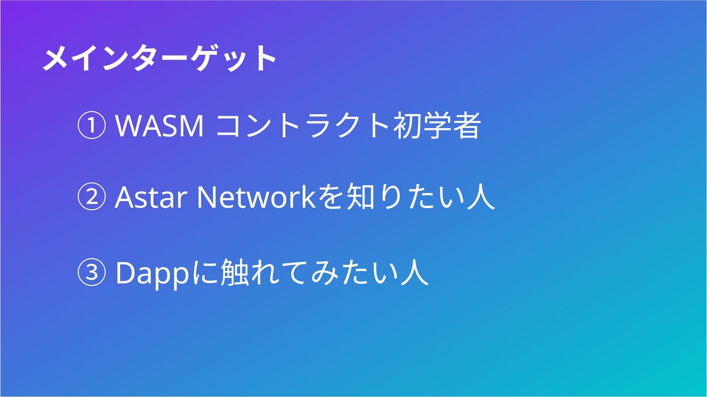
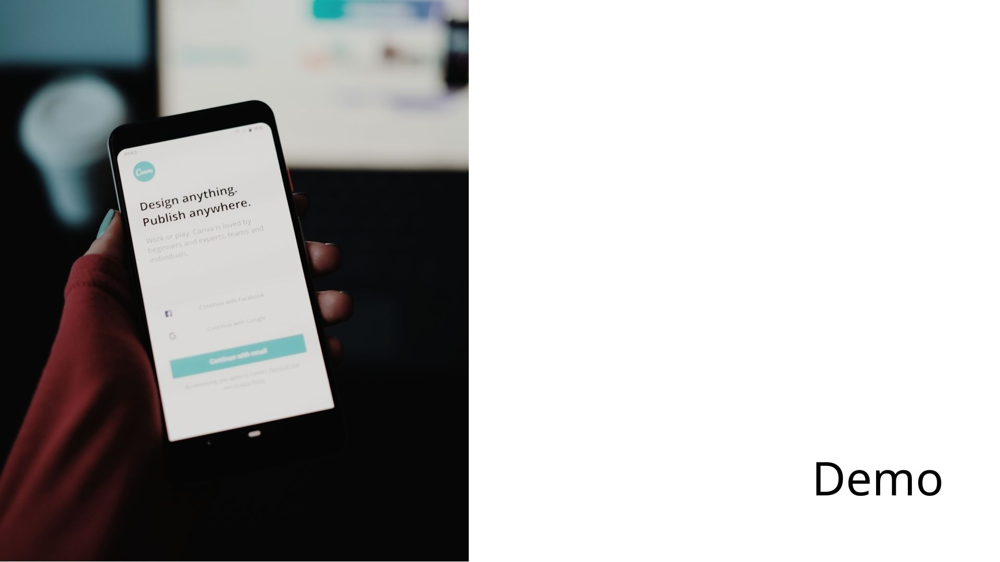
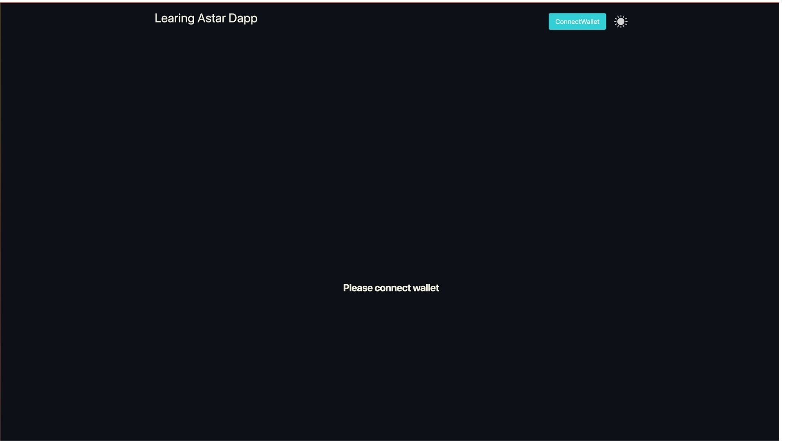
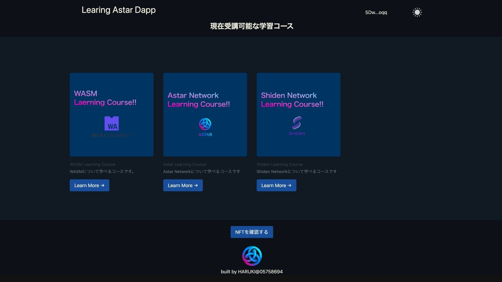
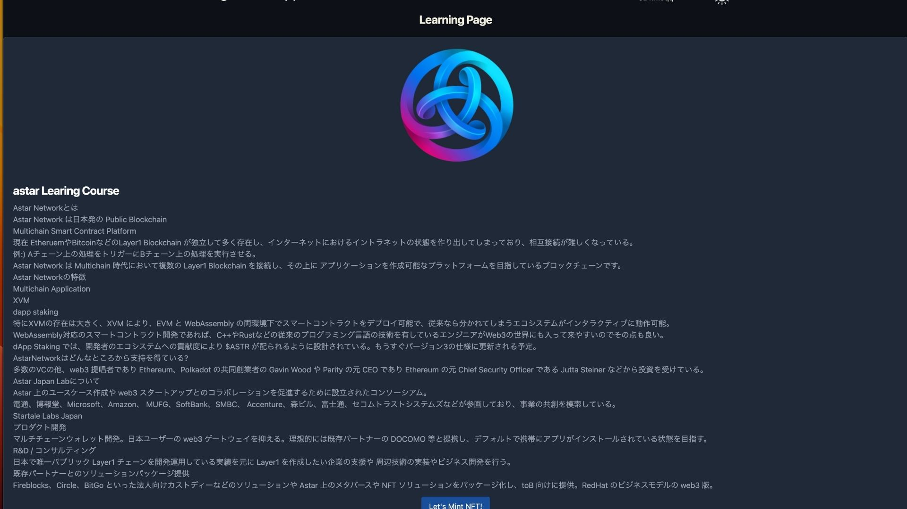
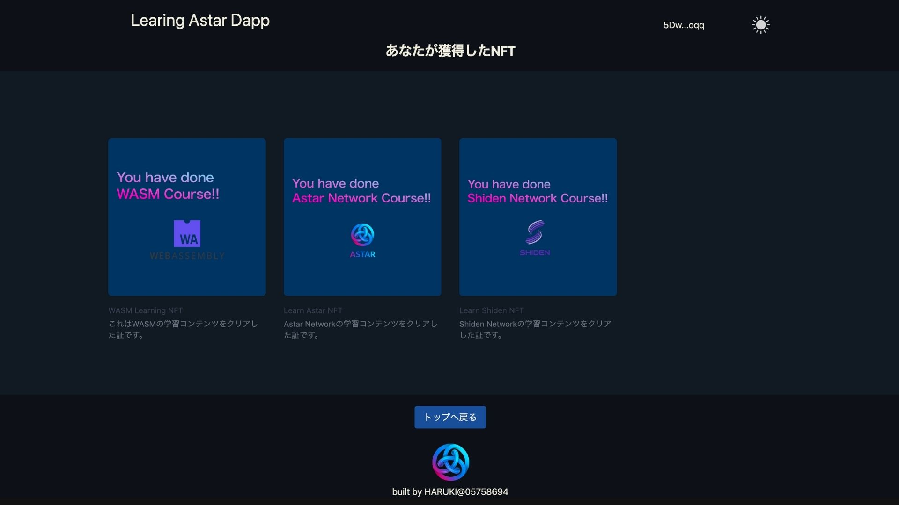

### Hackadot Pitch

- intro

      Hello, everyone.
      Let's start presenpetion of Astar Learning.

- Concept

      Astar Learning is a product that help to provide a mechanism  to actively share knowledge and learn from each other on Astar Network.

- Problems

      There are the three problems we hope to solve with Astar Learning.

      ①The number of WASM-compliant DApps has not increased enougth.
      ②Not much is known about WASM in the first place.
      ③Lack of educational content that provides knowledge and hands-on experience of WASM-compliant Dapp in parallel.

- soluves

      Astar Learning offers two solutions to that challenge.

      ① provide a place where engineers and non-engineers alike can learn about Astar Network and WASM.
      ② Astar Learning provides an incentive rule. Incentivize Astar Learning participants by having a system that pays rewards to those who provide quality learning content.

- demo

      Now for a demonstration.
      We will show you a demonstration of five different functions that we have developed.

      Information on NFT contracts and content contracts is registered from contracts-UI now.

      The NFT appears to have been minted and will be confirmed from the screen.

      users can throw in a small amount of Astar for the content if they think it is good quality learning content.This is an incentive for the content provider.

      Users can give high ratings to quality learning content.

- lastly, milestone

      We think of taking four milestones for the future of Astar learning.

      We think to expand front-end and back-end functionality in 2023 Q3.

      Seconed, we want to apply to dappstaking in 2023 Q4.

      Third, If adopted by dapp staking, we want to expand the number of users.
