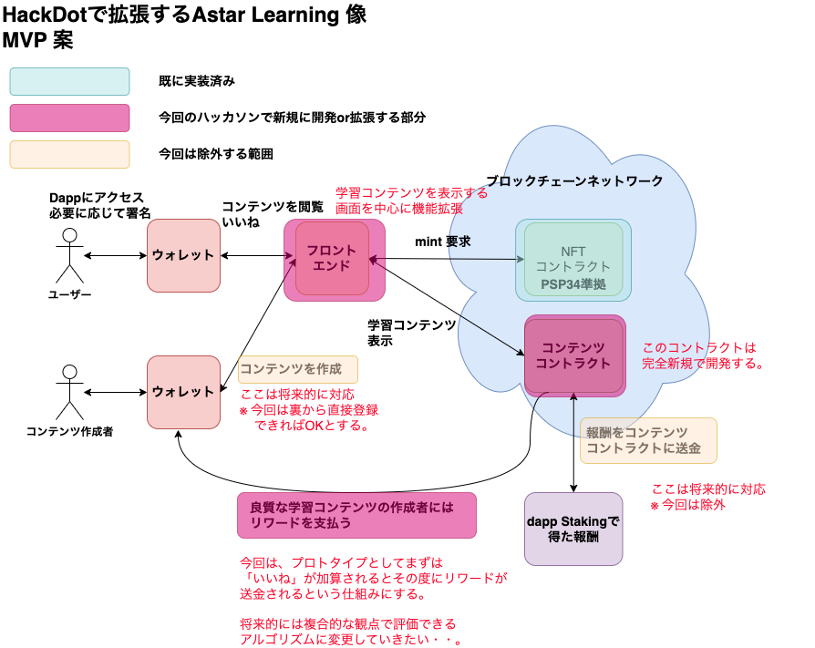

# HackaDot Summer 2023 に向けたMVPの設計と開発案

## Astar Learningのコアバリュー

WASMに対応したDAppは、EVMに比べるとまだまだ少ない。
アーリーアダプターとして一個しっかりしたDAppを作ること自体に価値があると考える。

教育系という分野で攻めて、管理者が不在でもこの界隈のエンジニア・非エンジニアが積極的に知識をシェアし合い、学び合う仕組みを作ることが大きな価値。

将来的にDapp Stakingと絡ませることができればリワードの財源も確保できるので半永久的に稼働する学習コンテンツアプリが出来上がる。(Dapp Stakingと絡ませればAstar Networkならではの価値とも合わせることができる。)

## 今回のハッカソンで目指す MVP

### システム概要図



### システムイメージ図

[Figma](https://www.figma.com/file/OwN0rRoVFEKXISc1TyjCcH/Astat-Learning-V2)

### 新規開発および拡張開発する画面

|No.|画面名|種別|大まかな機能|
|:----|:----|:----|:----|
|1|トップ画面|拡張|WalletConnectして最初にユーザーが閲覧する画面。学習コンテンツが並んで表示される。今は画面にベタ打ちして情報を表示しているが、この情報をコンテンツコントラクトから取得して表示するようにしたい。|
|2|コンテンツ画面|拡張|学習コンテンツ本体を表示する機能。この画面もベタ打ちしている状態だが、コンテンツコントラクトから取得して表示するようにしたい。今はこの画面からNFTをミントできるようにしているが、これはクイズ画面に移植させる。いいねボタンも実装したい。|
|3|クイズ画面|新規|今回完全新規に作成したいと考えている画面。コンテンツ画面から遷移してきて、4択の問題を出題する。回答方法はラジオボタンなどの選択式でコンテンツコントラクトに登録されている答えの番号と一致していれば正解となり、NFTをミントするボタンを表示する。|

※ `コンテンツ作成画面`は含めるとボリュームが一気に増える・・。
  間に合わない可能性があるため今回は見送り。

### 開発する機能

|No.|機能名|機能を利用する画面|概要|
|:----|:----|:----|:----|
|1|コンテンツ見出し情報取得機能|トップ画面|学習コンテンツの見出し情報を表示するために実装する機能|
|2|コンテンツ本体情報取得機能|コンテンツ画面|学習コンテンツ本体を表示するために実装する機能|
|3|いいね機能|コンテンツ画面|コンテンツ作成者に対してユーザーが任意にリワードを支払う機能。直接Transferすることにする。(宛先アドレスはあらかじめコンテンツコントラクト側に登録しておく。)|
|4|クイズ画面への遷移機能|コンテンツ画面|コンテンツ画面からクイズ画面へ遷移するための機能|
|5|クイズ情報取得機能|クイズ画面|クイズ画面で表示する4択の問題を表示するための機能|
|6|クイズ回答機能|クイズ画面|4択問題から答えを選び検証する機能、正解すればミントボタンを表示・そうでなければエラーがメッセージを出力するように実装する。|
|7|NFTミント機能|クイズ画面|NFTを発行するための機能。既に実装済で今はコンテンツコントラクトから呼び出しているが、ミントボタンを回答後のみ表示させるようにする。|


### 新規で開発する `コンテンツコントラクト` で実装しなければならない変数・関数

#### 変数

|No.|変数名|型|概要|
|:----|:----|:----|:----|
|1|contents|[ContentInfo]|コンテンツ情報を配列で格納する変数。ContentInfoは、独自の型として定義する。|
|1|contentLastId|u8|コンテンツIDを割り振るための変数。割り振られるたびに1加算していく。|

- <b>ContentInfo</b>で定義する変数

|No.|変数名|型|概要|デフォルト値|
|:----|:----|:----|:----|:----|
|1|contentId|u64|コンテンツごとに割り振るID・自動連番とする。|0|
|2|title|String|コンテンツのタイトル(HTMLの形式で保管)||
|3|intro|String|コンテンツ見出しの情報(HTMLの形式で保管)||
|4|content|String|コンテンツ本体の情報(Markdownの形式で保管)||
|5|goods|u64|「いいね」の数を保管(もしかしたら今回は、使わないかも)|0|
|6|statement|String|問題文を格納する変数||
|7|quizs|[String]|4択の選択肢を配列で格納する変数||
|8|answer|u8|問題の正解番号を格納する変数||
|9|imageUrl|String|コンテンツで使う画像ファイルまでURLを格納する変数||
|10|nftAddress|String|NFTコントラクトのアドレスを格納する変数||
|11|creator|String|コンテンツ作成者のアドレスを格納する変数||

#### 関数

|No.|関数名|パラメータ(型)|戻り値(型)|概要|
|:----|:----|:----|:----|:----|
|1|new||Self|初期化関数|
|2|default||Self|初期化関数2|
|3|getContent|&mut self,contentId|ContentInfo|指定したコンテンツの情報を一式取得するための関数|
|4|getContents|&mut self|[ContentInfo]|コントラクトに登録されている全てのコンテンツを取得するための関数|
|5|createContent|&mut self,title,content,quizs,answer,imageUrl,nftAddress,creator||コンテンツ情報を新規に登録するための関数|
|6|setImageUrl|&mut self,contentId, imageUrl||コンテンツに紐づかせる画像データを登録するための関数|
|7|getImageUrl|&mut self,contentId|String|コンテンツに紐づく画像データを取得するための関数|
|8|getIntro|&mut self,contentId|String|コンテンツの見出しを取得する関数|
|9|addGood|&mut self,contentId||コンテンツのgoodを加算する関数|


※ 将来的なコンテンツ作成画面の開発を見据えて、コンテンツ情報はコントラクト上で管理できるようにしておく。(今回は、コントラクトからgetするだけにとどめる。)

## 使用予定の技術スタック

| No. | 名称        | 概要                                       |
| --- | ----------- | ------------------------------------------ |
| 1   | !ink        | スマートコントラクト開発言語               |
| 2   | Next.js     | フロントエンド開発フレームワーク           |
| 3   | swanky      | スマートコントラクト開発フレームワーク     |
| 4   | TypeScript  | フロントエンド開発言語                     |
| 5   | NFTStorage  | NFT 用のメタデータ保管ストレージ           |
| 6   | Tailwind CSS  | フロントエンド用の CSS フレームワーク      |
| 7   | Contract-UI | スマートコントラクトのデプロイ・検証のため |
| 8   | MonoRepo | 開発効率の向上 |

## 全体のディレクトリ構成

`monorepo`構成にしています。

```bash
.
├── LICENSE       ライセンスファイル
├── README.md     プロジェクトのREADMEファイル
├── docs          設計書などの資材を格納するファイル
├── .github       GtiHub Actions用のCIファイルを格納するためのファイル  
├── node_modules  
├── package.json  
├── packages      フロントエンドとスマートコントラクトの資材を格納するためのディレクトリ
└── yarn.lock     
```

## フロントエンドのディレクトリ構造

`packages`ディレクトリの`frontend`ディレクトリ配下にあるソースコードがフロントエンド用のソースになります。

```bash
├── README.md           フロントエンド用のREADMEファイル
├── components            
│   ├── IndexCanvas     Home画面で利用するコンポーネントを格納するディレクトリ
│   ├── LearnCanvas     学習コンテンツ画面で利用するコンポーネントを格納するディレクトリ
│   ├── NftCanvas       NFT表示画面で利用するコンポーネントを格納するディレクトリ
│   └── common          ボタンやローディングなど共通で使うコンポーネントを格納するディレクトリ
├── context 
│   └── index.tsx       全画面共通で利用する変数および機能を実装したファイル NFTの実装や残高の取得のメソッドはここで定義する。
├── metadata            スマートコントラクトのABIファイルを格納するディレクトリ
│   └── nft.json        NFTコントラクトのABIファイル
├── next-env.d.ts       Next.jsの設定ファイル
├── next.config.js      Next.jsの設定ファイル
├── node_modules        
├── out                 ビルドした成果物を格納するディレクトリ
├── package.json        
├── pages               ページ用のコンポーネントを格納するディレクトリ
│   ├── _app.tsx        ベースとなるAppコンポーネント
│   ├── _document.tsx 
│   ├── _error.tsx      エラーページ用コンポーネント
│   ├── index.tsx       Home画面用のコンポーネントファイル
│   ├── learn           学習コンテンツ表示画面用のコンポーネントファイル
│   └── nfts            NFT表示画面用のコンポーネントファイル
├── postcss.config.js   post CSS用の設定ファイル
├── public              画像ファイルなどを格納
├── styles              スタイルシートを格納するためのファイル   
├── tailwind.config.js  Tailwind CSS用の設定ファイル
└── tsconfig.json       
```

## バックエンド(スマートコントラクト)のディレクトリ構造

`packages`ディレクトリの`backend`ディレクトリ配下にあるソースコードがスマートコントラクト用のソースになります。

```bash
.
├── README.md           スマートコントラクト用のREADMEファイル
├── artifacts           コンパイルの成果物
├── config.json         設定ファイル
├── contracts           
    ├── content         コンテンツコントラクト関連のファイルを格納するディレトリ
    └── nft             NFTコントラクト関連のファイルを格納するディレクトリ
├── nft_metadata        NFTで使用するメタデータを格納数ディレクトリ
├── node_modules        
├── package.json        
├── patches             
├── swanky.config.json  Swanky用の設定ファイル
├── test                テストファイルを格納するディレクトリ
└── tsconfig.json       
```